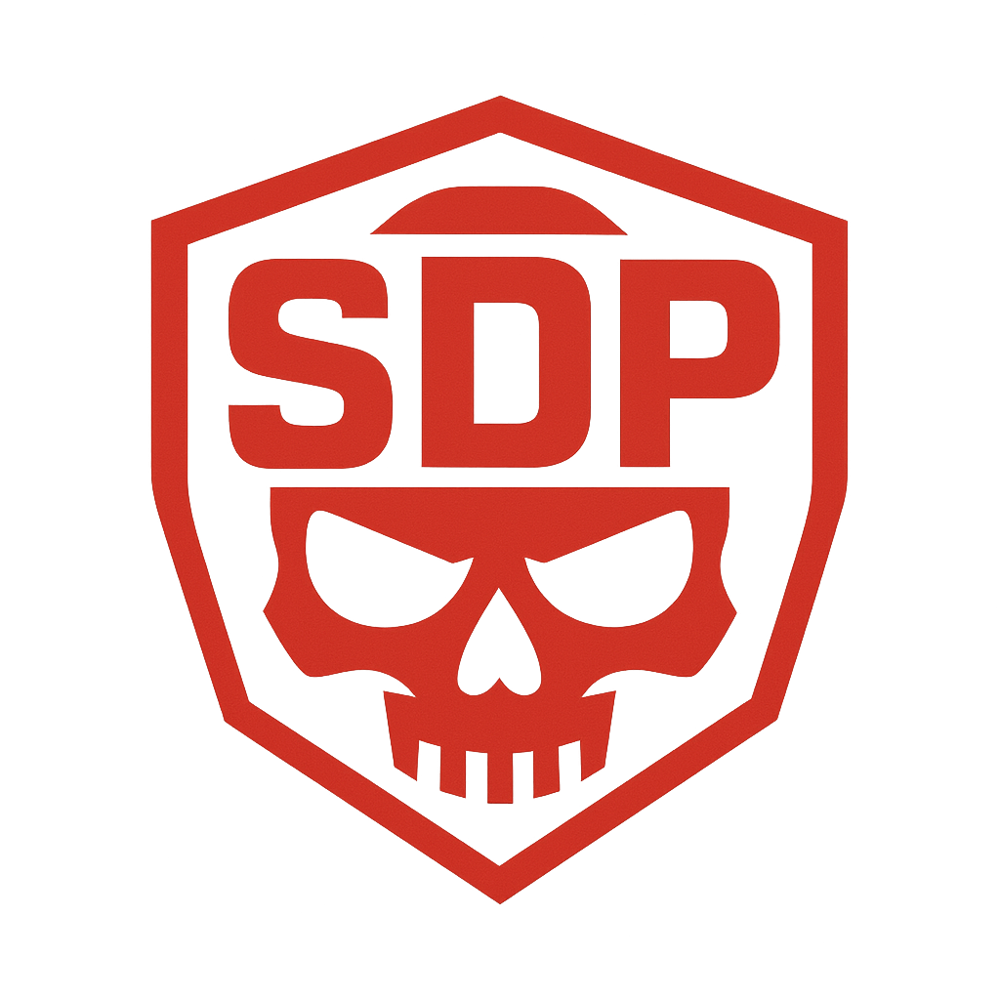

#  **SDP — Simple DOS Program **


---

## 🔥 Overview

**SDP** is a lightweight experimental networking project written in C++.  
It is designed for **educational, research and laboratory testing purposes only**.

This project demonstrates:
- Low-level socket programming  
- Controlled network traffic simulation  
- Safe research patterns for networking concepts  

---

## ⚠️ Legal & Ethical Notice

**Any use of this software to attack third-party servers, networks, or infrastructure (including DoS/DDoS) is illegal and strictly prohibited.**

This project is intended **only for:**
- Authorized security research
- Educational demonstrations
- Testing in isolated lab environments

> You are fully responsible for how you use this software.

---

## ✨ Features

- Minimal C++ codebase  
- Direct work with system sockets  
- TCP/UDP traffic generation modules (demonstration only)  
- Passive network analysis examples  
- No auto-scanners or built-in attack modules  

---

## 🛠 Build

> Recommended: build and run only inside isolated environments (VM, Docker, lab networks).

### Linux

```bash
g++ -O2 -pthread *.cpp -o sdp
